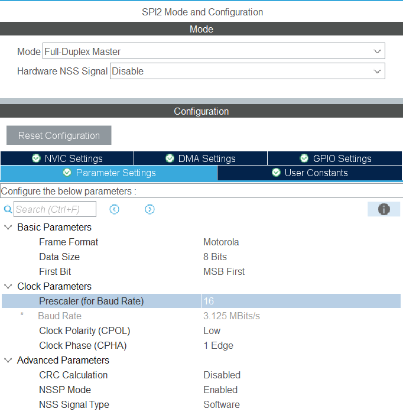
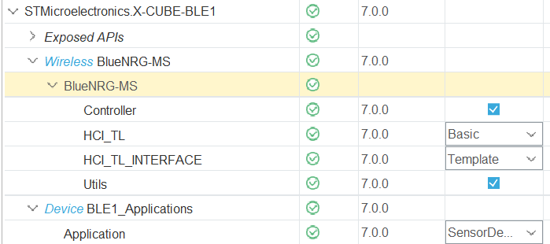
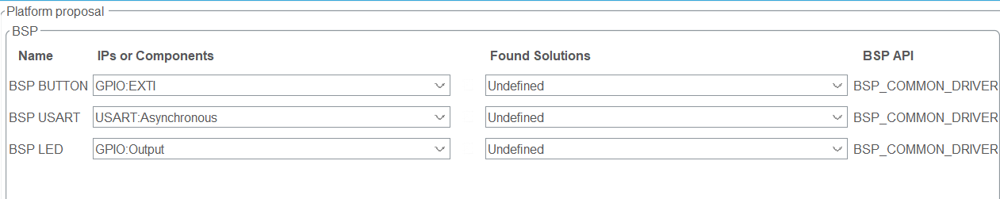
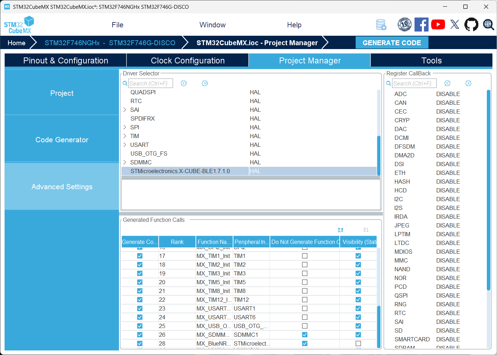
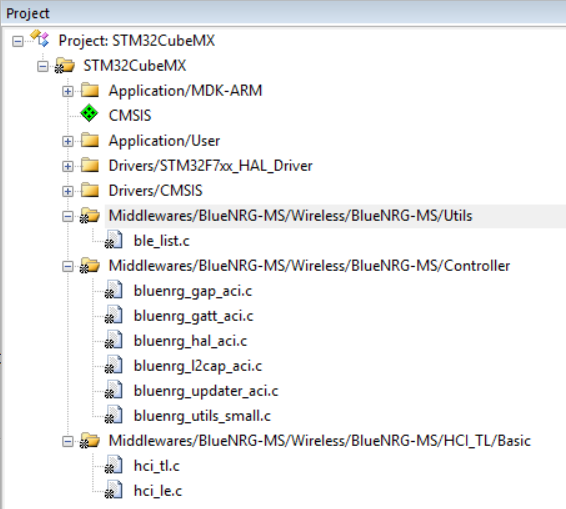

# GUI_VNC example project & Bluetooth

## Start from project with emWin en VNC

*Image 1: VNC - Real VNC*

*Image 2: Serial Port - Putty*

## Add bluetooth

### CubeMX

#### Pins

| PIN  | NAME        | FUNCTION |
|------|-------------|----------|
| PA0  | IRQ         | EXTI0    |
| PI1  | SPI2_SCK    | SPI2     |
| PB14 | SPI2_MISO   | SPI2     |
| PB15 | SPI2_MOSI   | SPI2     |
| PI3  | RST         | GPIO_OUT |
| PF10 | CSN         | GPIO_OUT |
| PI11 | PUSH_BUTTON | EXTI11   |
| PA9  | USART1_TX   | USART    |
| PB7  | USART1_RX   | USART    |
| PA15 | EXT_LED7    | GPIO_OUT |
| PA8  | EXT_LED8    | GPIO_OUT |

#### SPI2 Configuration

#### Bluetooth

Add Bluetooth firmware, kies “template” voor “hci-tl-interface”

Do not call Bluetooth init and process functions:

### Keil

### Source

Pas de uvprojx file aan door de verschillende “Group” elementen over te
nemen uit het project ".\STM32CubeMX\Target_1\STM32CubeMX\MDK-ARM\STM32CubeMX.uvprojx"

