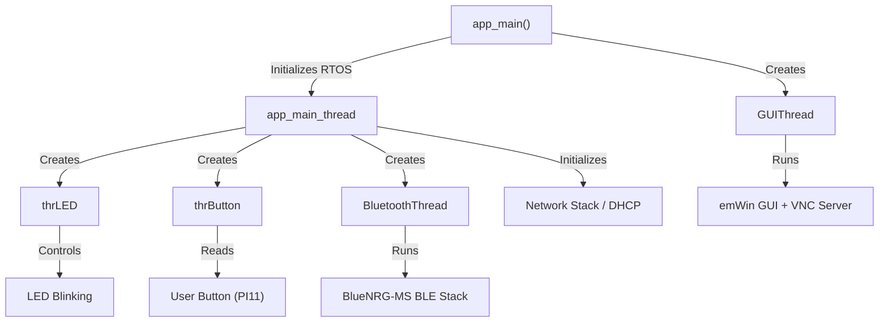

# STM32F746G-DISCO — GUI, VNC & Bluetooth Project

## Overview

This is an embedded systems project for the **STM32F746G Discovery** board (ARM Cortex-M7). It combines three major features into one application:

1. **Graphical User Interface (GUI)** — rendered on the board's built-in 4.3" LCD touchscreen
2. **VNC Server** — allowing remote viewing/control of the GUI over Ethernet
3. **Bluetooth Low Energy (BLE)** — wireless communication via an external BlueNRG-MS module

The project is built with **Keil µVision (MDK-ARM)** using the **CMSIS-RTOS2 (RTX5)** real-time operating system, and configured via **STM32CubeMX**.

---

## Architecture

The application runs as a **multi-threaded RTOS system** with the following concurrent threads:



### Threads at a Glance

| Thread | File | Purpose |
|---|---|---|
| `app_main_thread` | [Blinky.c](file:///d:/cursussen/iot-systems-advanced/bluetooth/Blinky.c) | Bootstraps everything: creates LED & button threads, initializes the network stack (Ethernet + DHCP), then starts the Bluetooth thread |
| `GUIThread` | [GUI_SingleThread.c](file:///d:/cursussen/iot-systems-advanced/bluetooth/GUI_SingleThread.c) | Initializes **emWin**, starts the **VNC server**, creates the GUI dialog, and runs the GUI event loop (touch + display refresh) |
| `thrLED` | [Blinky.c](file:///d:/cursussen/iot-systems-advanced/bluetooth/Blinky.c#L36-L61) | Blinks the on-board LED. Toggles between slow blink (500 ms) and fast blink (100 ms) when signalled by the button thread |
| `thrButton` | [Blinky.c](file:///d:/cursussen/iot-systems-advanced/bluetooth/Blinky.c#L66-L82) | Polls the user button state and sends a flag to the LED thread on press |
| `BluetoothThread` | [BluetoothThread.c](file:///d:/cursussen/iot-systems-advanced/bluetooth/BluetoothThread.c) | Initializes and continuously processes the **BlueNRG-MS** BLE stack |

---

## Key Components

### 1. GUI — emWin (SEGGER Graphics)

The graphical interface is built with the **emWin** embedded GUI library (SEGGER), generated via the **GUI Builder**.

- **Dialog file**: [FramewinDLG.c](file:///d:/cursussen/iot-systems-advanced/bluetooth/FramewinDLG.c) — defines a 480×272 pixel frame window with:
  - A **Button** widget
  - A **Checkbox** widget (labelled "Check")
  - A **Text** widget (displays an uptime counter in seconds)
- **Touchscreen driver**: [Touch_746G_Discovery.c](file:///d:/cursussen/iot-systems-advanced/bluetooth/Touch_746G_Discovery.c) — interfaces with the **FT5336** capacitive touch controller via I2C
- **LCD driver**: [LCD_X.c](file:///d:/cursussen/iot-systems-advanced/bluetooth/LCD_X.c) — port routines for the STM32F746's LTDC (LCD-TFT Display Controller)

### 2. VNC Server

The emWin **VNC Server** component is started inside the GUI thread:

```c
GUI_VNC_X_StartServer(0, 0);
```

This allows a **VNC client** (e.g. RealVNC) to connect to the board over Ethernet and see/interact with the same GUI displayed on the physical LCD. Any touch or click events from VNC are forwarded to emWin, making it fully remote-controllable.

> [!TIP]
> The board obtains its IP address via DHCP. The IP is printed to the serial console so you know where to connect your VNC client.

### 3. Bluetooth Low Energy (BlueNRG-MS)

The project integrates ST's **BlueNRG-MS** BLE stack for Bluetooth Low Energy communication. The BLE module is connected via **SPI2**:

| Pin | Signal | Function |
|---|---|---|
| PI1 | SPI2_SCK | SPI Clock |
| PB14 | SPI2_MISO | SPI Data In |
| PB15 | SPI2_MOSI | SPI Data Out |
| PF10 | CSN | Chip Select (GPIO) |
| PI3 | RST | Reset (GPIO) |
| PA0 | IRQ | Interrupt (EXTI) |

The Bluetooth middleware includes:
- **HCI Transport Layer** — SPI-based communication with the BlueNRG-MS chip
- **GAP, GATT, HAL, L2CAP ACI** — BLE protocol controllers
- **Utility functions** — linked list helpers

### 4. Networking (Ethernet)

The MDK Network stack provides:
- **Ethernet MAC + PHY** (LAN8742A) driver
- **TCP, UDP, BSD sockets**
- **DHCP client** — auto-assigns IP on boot
- **IPv4 + IPv6** (link-local) support

### 5. Serial Console (USART1)

[retarget_stdio.c](file:///d:/cursussen/iot-systems-advanced/bluetooth/retarget_stdio.c) redirects `printf` / `stdin` to **USART1** at **115200 baud** (PA9 TX, PB7 RX), enabling debug output via a serial terminal like PuTTY.

### 6. Virtual I/O

[vio.c](file:///d:/cursussen/iot-systems-advanced/bluetooth/vio.c) provides the **CMSIS-VIO** abstraction layer, mapping:
- `vioLED0` → PF6 (on-board LED)
- `vioBUTTON0` → PI11 (user button, with rising-edge interrupt)

---

## Hardware Pin Summary

| Pin | Name | Function |
|---|---|---|
| PA0 | BLE IRQ | External interrupt (EXTI0) |
| PA8 | EXT_LED8 | External LED (GPIO Output) |
| PA9 | USART1_TX | Serial console transmit |
| PA15 | EXT_LED7 | External LED (GPIO Output) |
| PB7 | USART1_RX | Serial console receive |
| PB14 | SPI2_MISO | BLE SPI data in |
| PB15 | SPI2_MOSI | BLE SPI data out |
| PF6 | LED (LD1) | On-board LED via VIO |
| PF10 | BLE CSN | BLE chip select |
| PI1 | SPI2_SCK | BLE SPI clock |
| PI3 | BLE RST | BLE reset |
| PI11 | USER BUTTON | Push button (EXTI11) |

---

## Toolchain & Dependencies

| Component | Details |
|---|---|
| **IDE** | Keil µVision (MDK-ARM) |
| **Compiler** | ARM Compiler 6 (AC6), C11 / C++11 |
| **Target MCU** | STM32F746NGHx (Cortex-M7, single-precision FPU) |
| **RTOS** | CMSIS-RTOS2 / RTX5 |
| **GUI Library** | SEGGER emWin (MDK-Pro) |
| **Network** | Keil MDK-Middleware Network |
| **BLE Stack** | ST BlueNRG-MS |
| **Config Tool** | STM32CubeMX |

---

## How It All Fits Together

1. **Power on** → `app_main()` initialises the RTOS kernel
2. **GUI thread** starts → emWin renders the dialog on the 480×272 LCD, VNC server listens for connections
3. **Main thread** starts → Ethernet initialises, DHCP acquires an IP, LED and button threads spawn, Bluetooth thread starts
4. **At runtime**:
   - The LCD shows a frame window with a button, checkbox, and live uptime counter
   - A VNC client can connect over Ethernet to remotely view and interact with the GUI
   - The BlueNRG-MS BLE stack runs continuously for wireless communication
   - The user button toggles the LED blink pattern between slow and fast
   - Debug output is available via serial console at 115200 baud
